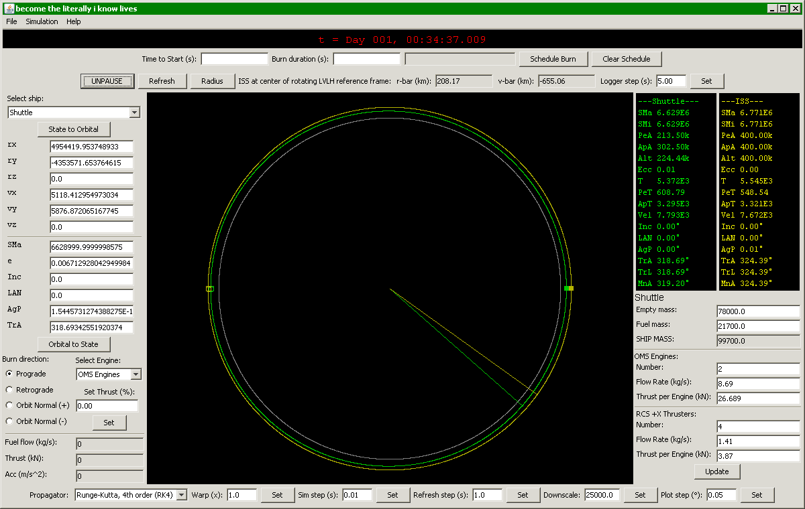

## ISS-Shuttle Rendezvous Simulator

This program simulates the ISS and the Space Shuttle in orbit around the Earth. Created this program to test the feasibility of various rendezvous procedures.

## Works Consulted:

- "Kepler Orbit Elements to Cartesian Coordinates Conversion" : http://ccar.colorado.edu/asen5070/primers/kep2cart_2000/kep2cart.htm
- "Keplerian Orbit Elements to Cartesian State Vectors" : https://downloads.rene-schwarz.com/download/M001-Keplerian_Orbit_Elements_to_Cartesian_State_Vectors.pdf
- "Cartesian State Vectors to Keplerian Orbit Elements" : https://downloads.rene-schwarz.com/download/M002-Cartesian_State_Vectors_to_Keplerian_Orbit_Elements.pdf
- "Orbital Equations" : http://www.bogan.ca/orbits/kepler/orbteqtn.html
- "Orbital Mechanics" : http://www.braeunig.us/space/orbmech.htm
- "Earth Fact Sheet" : http://nssdc.gsfc.nasa.gov/planetary/factsheet/earthfact.html
- "Gravitational Constant" : http://physics.nist.gov/cgi-bin/cuu/Value?bg
  - For the calculations, using:
    - M = 5.972E24 kg
    - R = 6.371E6 m
    - G = 6.67384E-11 N (m/kg)^2
- "Runge-Kutta Methods" : http://en.wikipedia.org/wiki/Runge%E2%80%93Kutta_methods
- "Runge-Kutta Algorithm" : http://www.myphysicslab.com/runge_kutta.html
- "List of Runge-Kutta Methods" : http://en.wikipedia.org/wiki/List_of_Runge%E2%80%93Kutta_methods
- "Shuttle Crew Operations Manual" (For Shuttle thrust, mass, etc.) : http://www.nasa.gov/centers/johnson/pdf/390651main_shuttle_crew_operations_manual.pdf

